# Power BI Embedded Dashboard

> **A showcase project demonstrating the full capabilities of Power BI Embedded JavaScript API** — visual creation, report authoring, dynamic filtering, and page management in a modern React application.

[](https://nextjs.org/)
[](https://react.dev/)
[](https://www.typescriptlang.org/)
[](https://tailwindcss.com/)
[](https://opensource.org/licenses/MIT)
[](https://powerbi.microsoft.com/)

## What This Project Demonstrates

This showcase covers the **complete Power BI Embedded feature set**:

| Feature | API Used |
|---------|----------|
| **Report Embedding** | `powerbi-client` embed API |
| **Visual Creation** | `powerbi-report-authoring` createVisual() |
| **Visual Editing** | changeVisualizationType(), setVisualData() |
| **Visual Deletion** | deleteVisual() |
| **Basic Filters** | IBasicFilter with In/NotIn operators |
| **Advanced Filters** | IAdvancedFilter with conditions |
| **Page-Level Filters** | page.setFilters() |
| **Visual-Level Filters** | visual.setFilters() |
| **Page Creation** | report.addPage() |
| **Page Deletion** | page.delete() |
| **Page Navigation** | report.setPage() |
| **Azure AD Auth** | MSAL client credentials flow |

## Why This Project?

- **Complete API Coverage** - Demonstrates nearly all Power BI Embedded capabilities
- **Modern Stack** - Next.js 16, React 19, TypeScript strict mode, Tailwind CSS v4
- **Production Patterns** - Azure AD authentication, error handling, type-safe API
- **Learn by Example** - Well-structured code with clear separation of concerns

## Features

### Report Embedding
- Secure Azure AD authentication using MSAL client credentials flow
- Responsive Power BI report embedding with full-screen support
- Multi-page navigation

### Visual Management
- **Create Visuals** - Build charts (bar, column, line, pie, donut, card, table) directly from the UI
- **Edit Visuals** - Modify existing visuals via context menu
- **Delete Visuals** - Remove visuals with confirmation
- **Position & Resize** - Set custom dimensions and placement

### Dynamic Filtering
- **Page-Level Filters** - Apply filters across all visuals on a page
- **Visual-Level Filters** - Target specific visuals
- **Basic Filters** - "In" / "Not In" operators for categorical data
- **Advanced Filters** - Conditions like Equals, Contains, GreaterThan, Range, etc.

### Page Management
- Create new report pages
- Delete existing pages
- Navigate between pages

## Tech Stack

| Technology | Purpose |
|------------|---------|
| **Next.js 16** | React framework with App Router |
| **React 19** | UI library with React Compiler |
| **TypeScript** | Type-safe development |
| **Tailwind CSS v4** | Utility-first styling |
| **Power BI Client** | Report embedding SDK |
| **Power BI Report Authoring** | Visual creation/editing API |
| **MSAL Node** | Azure AD authentication |
| **React Hook Form + Zod** | Form handling with validation |

## Architecture

```mermaid
flowchart TB
    subgraph NextApp["🚀 Next.js App"]
        direction TB
        
        subgraph Drawers["Drawer Components"]
            direction LR
            PAGES["📄 PagesDrawer"]
            VISUALS["📊 VisualsDrawer"]
            FILTERS["🔍 FiltersDrawer"]
        end

        MAIN["⚛️ PowerBIReport.tsx(Main Component)"]
        STATE["🔄 PowerBIContext.tsx(State Management)"]
        SDK["📦 Power BI JavaScript API(powerbi-client + powerbi-report-authoring)"]

        subgraph APILayer["API Layer"]
            API["🔐 /api/powerbiAzure AD Auth + Embed Token"]
        end
    end

    PAGES --> MAIN
    VISUALS --> MAIN
    FILTERS --> MAIN
    MAIN --> STATE
    STATE --> SDK
    SDK --> API
```



## Getting Started

### Prerequisites

- Node.js 18+
- pnpm
- Azure AD tenant with Power BI service
- Power BI Pro or Premium capacity

### Azure AD Setup

1. Register an application in Azure AD
2. Add API permissions: `Power BI Service` → `Report.ReadWrite.All`
3. Create a client secret
4. Grant admin consent for the permissions

### Installation

```bash
# Install dependencies
pnpm install

# Configure environment variables (see below)

# Start development server
pnpm dev
```

### Environment Variables

Create `.env.local` with your Azure AD and Power BI configuration:

```env
# Azure AD App Registration
POWERBI_CLIENT_ID=your-azure-app-client-id
POWERBI_CLIENT_SECRET=your-azure-app-client-secret
POWERBI_TENANT_ID=your-azure-tenant-id

# Azure AD Authority
POWERBI_AUTHORITY_URL=https://login.microsoftonline.com

# Power BI API
POWERBI_SCOPE=https://analysis.windows.net/powerbi/api/.default

# Power BI Report
POWERBI_WORKSPACE_ID=your-workspace-id
POWERBI_REPORT_ID=your-report-id
```

## Usage

### Creating a Visual

1. Navigate to a report page
2. Click the **Edit** button (pencil icon)
3. Select visual type (Bar, Column, Line, etc.)
4. Configure data fields (Category, Values)
5. Set position and dimensions
6. Click **Create Visual**

### Applying Filters

1. Click the **Filters** button (funnel icon)
2. Choose filter level: **Page** or **Visual**
3. Select table and column/measure
4. Choose filter type:
   - **Basic**: Select values from a list
   - **Advanced**: Define conditions (equals, contains, greater than, etc.)
5. Click **Apply Filter**

### Managing Pages

1. Click the **Pages** button (layers icon)
2. View all report pages
3. Click a page to navigate
4. Use **+** to create new pages
5. Use trash icon to delete pages

## Scripts

```bash
pnpm dev      # Start development server
pnpm build    # Build for production
pnpm start    # Start production server
pnpm lint     # Run ESLint
```

## Key Implementation Details

### Power BI Type Extensions

The Power BI JavaScript API has methods available at runtime that aren't in TypeScript definitions. This project uses type guards and safe casting in `src/lib/powerbi-type-guards.ts`:

```typescript
// Runtime capability detection
if (hasDeletePageCapability(page)) {
  await page.delete();
}

// Safe casting helper
const visual = asExtendedVisual(visualDescriptor);
```

### Filter Architecture

Filters use a builder pattern to convert app configuration to Power BI filter objects:

```typescript
// App-level filter config
const filter: FilterConfig = {
  filterType: "basic",
  target: { table: "Sales", column: "Region" },
  operator: "In",
  values: ["West", "East"]
};

// Converts to Power BI IBasicFilter
const pbiFilter = buildFilter(filter);
await report.setFilters([pbiFilter]);
```

## Who Is This For?

- **Developers** learning Power BI Embedded JavaScript API
- **Teams** evaluating Power BI Embedded capabilities
- **Architects** looking for implementation patterns
- **Anyone** building embedded analytics with Power BI

## Power BI Features Showcased

- `powerbi-client` - Report embedding and interaction
- `powerbi-report-authoring` - Visual creation and editing
- Basic Filters (In, NotIn)
- Advanced Filters (Equals, Contains, GreaterThan, LessThan, Range)
- Page-level and Visual-level filter scopes
- Report page CRUD operations
- Context menu extensions
- Embed token authentication

## Contributing

See [CONTRIBUTING.md](CONTRIBUTING.md) for guidelines.

## License

This project is licensed under the [MIT License](LICENSE).

## Acknowledgments

- [Power BI Embedded Documentation](https://docs.microsoft.com/en-us/power-bi/developer/embedded/)
- [Power BI JavaScript API](https://github.com/Microsoft/PowerBI-JavaScript)
- [Next.js Documentation](https://nextjs.org/docs)

---

**Star this repo** if you find it helpful! Questions? [Open an issue](https://github.com/more-shubham/powerbi-embedded-dashboard/issues).
